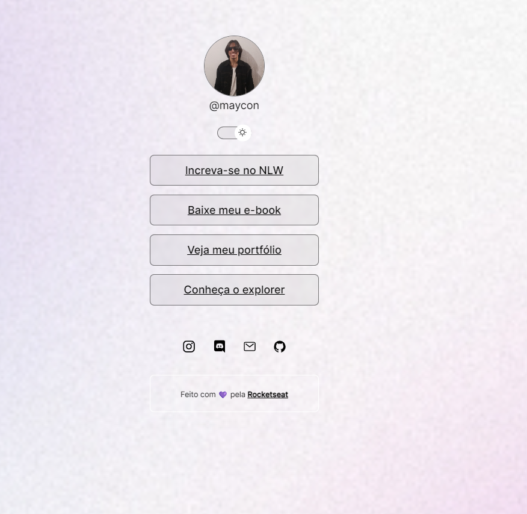

<h1 align="center"> Dev Links <h1>

Evento exclusico e gratuitp, promovido pela Rockestseat para ensino de tacnlogias WEB.

  <a href="#-tecnologias">Tecnologias</a>
  <a href="#-projeto">Projeto</a>
  <a href="#-tecnologias">Layout</a>
  <a href="#-tecnologias">Licença</a>

 

  

## 💻 Tecnologias 

Esse projeto foi desenvolvido com as seguintes tecnologias:

- HTML e CSS
- JavaScript
- Git e Github

## 🎻 Projeto

O Devlinks é um agregador de links para usar como cartão de visitas online
